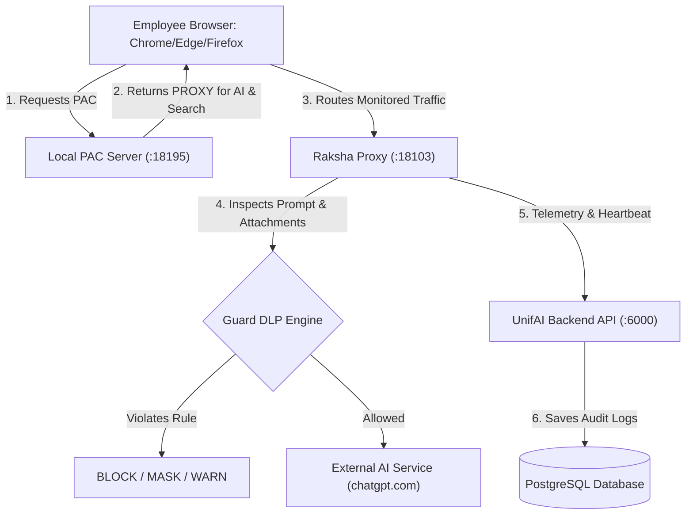

# UnifAI & Raksha Enterprise — Complete System & Administrator Guide

**Version:** 1.1.16  
**Audience:** Platform Administrators, Security Engineers, DevOps, Compliance Teams  
**Platform URL:** `https://unifai.yespanchi.com`  

---

## Table of Contents
1. [System Architecture & Codebase Folder Structure](#1-system-architecture--codebase-folder-structure)
2. [Administrator Access & Authentication](#2-administrator-access--authentication)
3. [Dashboard Overview & Key Metrics](#3-dashboard-overview--key-metrics)
4. [Observability Suite](#4-observability-suite)
   - [4.1 LLM Logs](#41-llm-logs)
   - [4.2 Log Details & Inspection Sheet](#42-log-details--inspection-sheet)
   - [4.3 How to Export Logs & File Structure](#43-how-to-export-logs--file-structure)
   - [4.4 MCP Logs (Model Context Protocol)](#44-mcp-logs-model-context-protocol)
   - [4.5 Third-Party Connectors (Datadog, New Relic, BigQuery, Kafka, PubSub)](#45-third-party-connectors)
   - [4.6 Logs Settings & Data Retention](#46-logs-settings--data-retention)
5. [Browser AI & Desktop Guard (Raksha Guard)](#5-browser-ai--desktop-guard-raksha-guard)
   - [5.1 Architecture & PAC Routing](#51-architecture--pac-routing)
   - [5.2 Target Websites (Monitored vs Blocked)](#52-target-websites-monitored-vs-blocked)
   - [5.3 Guard Rules (DLP, PII Regex & Policy Actions)](#53-guard-rules-dlp-pii-regex--policy-actions)
   - [5.4 Prompt Logs & File Attachment Audit](#54-prompt-logs--file-attachment-audit)
   - [5.5 Search Logs & Predictive Threat Risk](#55-search-logs--predictive-threat-risk)
   - [5.6 Guard Setup & Deployment (Windows & macOS)](#56-guard-setup--deployment-windows--macos)
   - [5.7 Guard Agents (Heartbeat, Health, Remote Controls)](#57-guard-agents-heartbeat-health-remote-controls)
   - [5.8 Guard Insights & Security Analytics](#58-guard-insights--security-analytics)
6. [Models, Providers & Intelligent Routing](#6-models-providers--intelligent-routing)
   - [6.1 Model Providers Configuration](#61-model-providers-configuration)
   - [6.2 Complexity Router & Fallbacks](#62-complexity-router--fallbacks)
7. [Governance (Virtual Keys, Users, Teams, SCIM/SSO)](#7-governance-virtual-keys-users-teams-scimsso)
   - [7.1 Virtual Keys & Budget Caps](#71-virtual-keys--budget-caps)
   - [7.2 Users, Teams & RBAC](#72-users-teams--rbac)
   - [7.3 Enterprise SSO & SCIM Directory Sync](#73-enterprise-sso--scim-directory-sync)
8. [Troubleshooting & Maintenance Playbook](#8-troubleshooting--maintenance-playbook)

---

## 1. System Architecture & Codebase Folder Structure

The UnifAI / Raksha platform is built with a decoupled enterprise architecture:
- **FastHTTP Gateway & Core Engine (Go):** Handles tens of thousands of requests per second for LLM proxying, policy checks, and log streaming.
- **Enterprise Management UI (Next.js & TypeScript):** Full-featured React dashboard using Tailwind CSS and Radix UI primitives.
- **Desktop Endpoint Guard Agent (Python & Rust/C):** Lightweight client agent running on macOS and Windows to enforce Browser AI security and PAC routing.

```
d:/unifai_project/
├── apps/
│   └── browser-guard/               # Desktop Endpoint Guard Agent (Windows & macOS)
│       ├── agent/                   # Local PAC server, heartbeat, autoupdate, identity
│       │   ├── agent_autoupdate.py  # Silent background installer updater
│       │   ├── agent_pac_content.py # Local proxy.pac generator & search engine rule injector
│       │   ├── agent_pac_server.py  # Serves http://127.0.0.1:18195/pac
│       │   ├── guard_bootstrap.py   # Launcher and dynamic hot-code bundle loader
│       │   └── raksha_agent.py      # Main entry point for the desktop agent
│       ├── installer/               # Packaging scripts (Inno Setup ISS, macOS shell scripts)
│       ├── proxy/                   # mitmproxy addon and interception engine
│       │   └── raksha_proxy_parts/  # DLP rules, upload detector, search logger
│       ├── release/                 # Distributable binaries (.exe, .pkg, .zip)
│       └── Raksha_Guard.spec        # PyInstaller specification for Windows
├── configs/                         # Static configurations & environment defaults
├── data/                            # Local database backups, sqlite, certificates
├── deploy/                          # Dockerfiles, Helm charts, Systemd units
├── docs/                            # Documentation repository
├── framework/
│   ├── configstore/                 # Application configuration storage & migrations
│   ├── connectors/                  # Streaming telemetry (Datadog, BigQuery, Kafka, etc.)
│   ├── logstore/                    # PostgreSQL log queries, search logs, PAC generator
│   └── rbac/                        # Role-based access control engine
├── transports/
│   └── raksha-http/                 # High-performance FastHTTP Backend Gateway
│       ├── handlers/                # HTTP API routes (/api/logs, /api/browser-ai/*)
│       └── server/                  # Core HTTP server initialization & plugin pipeline
└── ui/                              # Next.js / React Admin Management Dashboard
    ├── app/                         # App router (login, signup, workspace routes)
    ├── components/                  # UI components, tables, sheets, charts, filters
    └── lib/                         # State management, API hooks (RTK Query), types
```

---

## 2. Administrator Access & Authentication

### 2.1 Sign-In Portal
* **URL:** `https://unifai.yespanchi.com/login`
* **Default Admin Credentials:**
  * **Email:** `admin@yespanchi.com`
  * **Password:** Configured via `ADMIN_PASSWORD` in `.env` (Default: `YP2025-2026yp`)

### 2.2 First-Run Security Checklist
1. **Change Default Credentials:** Navigate to **Governance -> Users**, select the `admin@yespanchi.com` profile, and update to a secure corporate master password.
2. **Setup SMTP / Email Delivery:** Navigate to **Settings -> Email / SMTP** to configure your relay server (SendGrid, AWS SES, or corporate SMTP) so password reset tokens and verification emails work reliably.
3. **Session Lifetimes:** Admin sessions are issued with JWT HTTP-only cookies that auto-refresh on active usage. Inactive sessions expire after 24 hours.

---

## 3. Dashboard Overview & Key Metrics

Upon logging in, the **Main Dashboard** (`/workspace/dashboard`) renders real-time performance and financial telemetry across all connected models:

| Metric Card | Description | Calculation / Source |
|---|---|---|
| **Total Requests** | Total number of LLM inferences processed | `COUNT(*) FROM logs` across the selected time range |
| **Success Rate** | Overall platform reliability percentage | `(Successful Requests / Total Requests) * 100` |
| **User Success Rate** | Success rate perceived by client apps | Excludes internal fallback retry attempts |
| **Average Latency** | Time taken from prompt dispatch to completion | `AVG(latency_ms)` across models |
| **Total Tokens** | Cumulative token consumption | `SUM(prompt_tokens + completion_tokens)` |
| **Total Cost** | Financial expenditure across all providers (USD) | Derived from token volume multiplied by provider pricing |

### Interactive Filters
* **Time Range Selector:** Real-time (last 1 hour), 24 Hours, 7 Days, 30 Days, or Custom Date Range.
* **Provider / Model Filter:** Drill down into specific models (e.g., `gpt-4o`, `claude-3-5-sonnet`, `gemini-1.5-pro`).
* **Virtual Key / Team Filter:** Filter metrics by specific business units or client applications.

---

## 4. Observability Suite

### 4.1 LLM Logs (`/workspace/logs`)
A real-time ledger of every inference transaction passing through the UnifAI Gateway.

#### Table Columns & Information:
* **Time:** Exact timestamp when the prompt was submitted (UTC or browser timezone).
* **Status:** 
  * `200 Success` (Green badge)
  * `4xx / 5xx Error` (Red badge showing exact HTTP error or timeout)
  * `Fallback Active` (Amber badge indicating primary failed and fallback took over)
* **Provider:** Upstream vendor (OpenAI, Anthropic, Google, Azure, Mistral, AWS Bedrock, etc.).
* **Model:** Target model identifier (e.g., `gpt-4o`, `claude-3-5-sonnet-20241022`).
* **Type:** Inference modality (`Chat`, `Completion`, `Embedding`, `Vision`, `Speech`, `Realtime`).
* **Alias / Virtual Key:** The application key or client identity used to authenticate.
* **Latency:** End-to-end execution time in milliseconds (gateway parsing + upstream generation).
* **Tokens Breakdown:** Split display showing `Prompt Tokens` (in), `Completion Tokens` (out), and `Total Tokens`.
* **Cost:** Calculated expenditure in USD down to 6 decimal places.
* **User & Team:** Tagged enterprise team, business unit, or end-user identifier.

### 4.2 Log Details & Inspection Sheet
Clicking any row in the LLM Logs table slides out the comprehensive **Log Inspection Sheet**:
1. **Request Payload Tab:** Formatted JSON viewer of the incoming request body, system prompt, temperature, max tokens, and user messages.
2. **Response Payload Tab:** Formatted JSON viewer of the model output, finish reason, and tool calls.
3. **HTTP Headers & Gateway Metadata:** Client IP address, user-agent, routing engine decisions, retry history, and fallback path.
4. **Latency Waterfall:** Visual latency split showing Gateway preprocessing time, network round-trip, and first-token-to-last-token generation duration.
5. **Recalculate Cost:** Allows retroactively recalculating the cost of historical logs when model pricing changes.

### 4.3 How to Export Logs & File Structure

#### How to Export:
1. Navigate to **Observability -> LLM Logs**.
2. Apply your desired filters (Date range, Status, Virtual Key, Provider).
3. Click the **Export** button in the top-right toolbar.
4. Choose your preferred file format: **CSV**, **JSON**, or **Excel (XLSX)**.

#### File Naming Convention & Directory:
* When downloaded through the browser, files save directly to your computer's **Downloads** folder:
  * CSV format: `llm-logs_YYYY-MM-DD_HH-mm.csv`
  * JSON format: `llm-logs_YYYY-MM-DD_HH-mm.json`
  * Excel format: `llm-logs_YYYY-MM-DD_HH-mm.xlsx`

#### Export Data Schema:
```csv
Time,Status,Provider,Model,Type,Alias,Virtual Key,Latency,Prompt Tokens,Completion Tokens,Total Tokens,Cost,User,Team,Customer,Business Unit,Routing Engine,Routing Rule,Stream,Retries
2026-10-03 10:25:01,200,OpenAI,gpt-4o,Chat,prod-chatbot,vk_live_8912,412ms,245,128,373,$0.00214,sakthi,Engineering,Customer-A,DevOps,complexity-router,rule-fallback-openai,true,0
```

### 4.4 MCP Logs (Model Context Protocol) (`/workspace/mcp-logs`)
Audits all agentic tool invocations made by models through the Model Context Protocol:
* **Tool Name:** Name of the function executed by the LLM (e.g., `query_database`, `web_search`, `fetch_ticket`).
* **MCP Server:** Target server URI or local container hosting the tool.
* **Input Arguments:** JSON object of arguments generated by the model.
* **Execution Result:** Return value supplied back into the model's conversation context.
* **Session ID:** Grouping key allowing you to inspect full multi-turn autonomous agent sessions.

### 4.5 Third-Party Connectors (`/workspace/observability/connectors`)
UnifAI streams all logs, metrics, and security audits directly to your enterprise SIEM, data warehouse, or message queue.

#### 1. Datadog
* **Navigation:** Click **Connectors -> Datadog**.
* **Configuration:**
  * Enter your **Datadog API Key**.
  * Select your **Datadog Site** (`datadoghq.com` for US or `datadoghq.eu` for EU).
  * Toggle **Enable Streaming**.
* **Emitted Metrics:** `unifai.llm.requests`, `unifai.llm.tokens.prompt`, `unifai.llm.tokens.completion`, `unifai.llm.cost`, `unifai.llm.latency_ms`.

#### 2. New Relic
* **Navigation:** Click **Connectors -> New Relic**.
* **Configuration:**
  * Enter your **New Relic Ingest License Key**.
  * Select your **Data Center** (US / EU).
  * Click **Save & Test Connection**.
* **Telemetry:** Structured log events stream into the `NR_UNIF_AI_LOGS` table with queryable NRQL attributes.

#### 3. Google BigQuery
* **Navigation:** Click **Connectors -> BigQuery**.
* **Configuration:**
  * Provide **GCP Project ID**, **BigQuery Dataset ID**, and **Table ID** (e.g., `unifai_telemetry.llm_logs`).
  * Upload your **GCP Service Account JSON Key** (requires `roles/bigquery.dataEditor`).
* **Operation:** Gateway streams logs asynchronously in micro-batches (every 5 seconds or 500 rows) with zero impact on request latency.

#### 4. Apache Kafka
* **Navigation:** Click **Connectors -> Kafka**.
* **Configuration:**
  * **Brokers:** Comma-separated broker list (e.g., `kafka-1.internal:9092,kafka-2.internal:9092`).
  * **Topic Name:** e.g., `ai-governance-audit-events`.
  * **Authentication:** Choose `None`, `SASL/PLAIN`, or `SASL/SCRAM-512` and provide credentials.

#### 5. Google Cloud Pub/Sub
* **Navigation:** Click **Connectors -> Pub/Sub**.
* **Configuration:**
  * Provide **GCP Project ID** and **Topic ID**.
  * Upload your **Service Account Key**.

### 4.6 Logs Settings & Data Retention (`/workspace/settings/logs`)
* **Retention Policy:** Configure automatic purging of logs older than 30, 60, 90, 180, or 365 days.
* **PII Redaction at Rest:** Automatically masks credit card numbers, email addresses, and phone numbers before writing to PostgreSQL.
* **Zero-Persistence Mode:** Optionally configure the gateway to log only metadata (tokens, latency, cost) while discarding prompt and response text payloads for compliance (HIPAA, PCI-DSS).

---

## 5. Browser AI & Desktop Guard (Raksha Guard)

Browser AI is the endpoint security subsystem designed to monitor, audit, and safeguard employee interactions with external generative AI websites (ChatGPT, Claude, Gemini, DeepSeek, etc.) and search engines.



### 5.1 Architecture & PAC Routing
* **Zero Overhead PAC Architecture:** The desktop agent runs a lightweight local PAC server on `http://127.0.0.1:18195/pac`.
* **Selective Interception:** Standard internet traffic (internal intranets, GitHub, news, streaming) is routed `DIRECT` without passing through any proxy.
* **Local Proxy Port:** The interception engine listens on `127.0.0.1:18103` using a local enterprise root CA (`Raksha Enterprise Root CA`) installed into the system trust store.

### 5.2 Target Websites (Monitored vs Blocked) (`/workspace/browser-ai?tab=target-websites`)
Controls which public AI platforms are governed by the desktop agent:
* **MONITORED Domains:** Traffic is intercepted, prompts are recorded in audit logs, and DLP rules are evaluated (e.g., `chatgpt.com`, `claude.ai`, `gemini.google.com`, `deepseek.com`, `perplexity.ai`).
* **BLOCKED Domains:** Traffic is rejected instantly with a corporate access denial banner before any connection is made.
* **Adding a Domain:**
  1. Click **Add Target Website**.
  2. Enter the domain pattern (e.g., `poe.com` or `custom-ai.external.com`).
  3. Select **MONITORED** or **BLOCKED**.
  4. Click **Save**. The local PAC files on all connected endpoints update automatically within 3–5 seconds.

### 5.3 Guard Rules (DLP, PII Regex & Policy Actions) (`/workspace/browser-ai?tab=guard-rules`)
Enforce data loss prevention rules across prompts and uploaded attachments:

#### Rule Matching Engines:
* **Regex Patterns:** Built-in and custom regex rules matching Credit Card numbers, Social Security Numbers (SSN), AWS/GCP API Keys, Private SSH keys, and passwords.
* **Keyword Dictionaries:** Lists of sensitive project codenames, client names, internal URLs, or confidential phrases.

#### Enforcement Actions:
* **BLOCK:** The request is aborted before reaching the AI provider. The employee receives a desktop popup explaining the company security policy violation.
* **WARN:** The prompt is permitted, but the employee is shown a warning dialog reminding them of data classification guidelines.
* **MASK:** Sensitive tokens (e.g., credit card numbers or API keys) are replaced in-flight with `[REDACTED]` before forwarding to the AI service.
* **ALERT:** The prompt is allowed quietly, and an immediate high-priority alert is sent to security administrators.

### 5.4 Prompt Logs & File Attachment Audit (`/workspace/browser-ai?tab=prompt-logs`)
* **Prompt Content:** View the exact text entered into monitored AI chatbots.
* **File Upload Audit:** Tracks documents attached to AI prompts (PDFs, DOCX, CSV, TXT, images). Extracts plain text and performs OCR to scan for confidential leaks.
* **Client Identifiers:** Displays user machine hostname, OS username, internal IP address, browser type, and exact timestamp.

### 5.5 Search Logs & Predictive Threat Risk (`/workspace/browser-ai?tab=search-logs`)
Captures search engine queries across Google, Bing, DuckDuckGo, and Yahoo to detect reconnaissance and insider threats before data exfiltration occurs:
* **Monitored Browsers:** Google Chrome, Microsoft Edge, Mozilla Firefox, Brave, Safari, Opera.
* **Incognito / Private Mode:** Fully inspected and logged even when private browsing is enabled.
* **Predictive Threat Scoring:**
  * **CRITICAL (Risk Score 90–92):** Intent to bypass security controls, sabotage, or exploit vulnerabilities (e.g., `"how to kill raksha guard"`, `"bypass endpoint dlp"`, `"dump postgres password"`).
  * **HIGH (Risk Score 78):** Exfiltration of corporate intellectual property (e.g., `"upload proprietary codebase to external repo"`, `"internal financial forecasts 2026"`).
  * **MEDIUM (Risk Score 45):** Corporate reconnaissance or high-risk topics (e.g., `"competitor executive salaries"`, `"confidential legal settlements"`).
  * **LOW (Risk Score 10):** Standard daily technical, operational, and informational queries.

### 5.6 Guard Setup & Deployment (Windows & macOS) (`/workspace/browser-ai?tab=setup`)

#### Binary Artifacts:
* **Windows:** [`apps/browser-guard/release/Raksha_Guard_Setup.exe`](file:///d:/unifai_project/apps/browser-guard/release/Raksha_Guard_Setup.exe) (or `.zip` containing standalone binaries).
* **macOS:** [`apps/browser-guard/release/Raksha_Guard_Setup.pkg`](file:///d:/unifai_project/apps/browser-guard/release/Raksha_Guard_Setup.pkg).

#### Enterprise Silent Deployment:
* **Windows (via Microsoft Intune / SCCM / GPO):**
  ```powershell
  Raksha_Guard_Setup.exe /VERYSILENT /NORESTART /SUPPRESSMSGBOXES
  ```
* **macOS (via JAMF / Kandji / Munki):**
  ```bash
  sudo installer -pkg Raksha_Guard_Setup.pkg -target /
  ```

#### Tamper Protection & Uninstall Key:
* End users cannot stop or uninstall Raksha Guard without administrative privilege.
* To uninstall, administrators retrieve the unique **Uninstall Key** from the **Setup** tab and enter it into the installer uninstaller dialog.

### 5.7 Guard Agents (Heartbeat, Health, Remote Controls) (`/workspace/browser-ai?tab=guard-agents`)
* **30-Second Heartbeat:** Every client agent transmits a background heartbeat reporting agent version, operating system, PAC status, and certificate trust status.
* **Agent Health Badges:**
  * `HEALTHY` (Green): Proxy active on `18103`, PAC active on `18195`, CA certificate trusted.
  * `DEGRADED` (Yellow): PAC in fail-open mode or certificate needs re-trusting.
  * `OFFLINE` (Gray): Computer powered off or offline for > 5 minutes.
* **Remote Commands:** Administrators can remotely push configuration updates, restart local proxy services, or trigger remote uninstallation directly from the dashboard table.

### 5.8 Guard Insights & Security Analytics (`/workspace/browser-ai?tab=insights`)
Visual graphs showing:
* **AI Tool Adoption:** Breakdown of employee usage across ChatGPT vs. Claude vs. Gemini vs. DeepSeek.
* **Top Violators:** Employees generating the highest volume of blocked or warned DLP prompts.
* **Threat Query Heatmap:** Spike detection in high-risk search queries across departments.

---

## 6. Models, Providers & Intelligent Routing

### 6.1 Model Providers Configuration (`/workspace/providers`)
Manage upstream provider connections:
* Add master API keys for OpenAI, Anthropic, Google Vertex AI, Azure OpenAI, Mistral, AWS Bedrock, Cohere, Groq, or self-hosted Ollama / vLLM.
* Set organization-level max concurrency and rate limits per provider.

### 6.2 Complexity Router & Fallbacks (`/workspace/routing-rules`)
* **Complexity Routing:** Evaluates incoming prompt token count and semantic difficulty. Routes simple queries to cost-effective models (e.g., `gpt-4o-mini`, `gemini-1.5-flash`) and complex queries to frontier models (`gpt-4o`, `claude-3-5-sonnet`).
* **Automated Fallback Cascade:** If OpenAI returns `429 Too Many Requests` or `503 Service Unavailable`, the request is automatically rerouted to Anthropic or Azure OpenAI without failing the client application.
* **Circuit Breakers:** Automatically isolates a failing provider for 60 seconds if error rates surpass 25%, preventing cascading latency.

---

## 7. Governance (Virtual Keys, Users, Teams, SCIM/SSO)

### 7.1 Virtual Keys & Budget Caps (`/workspace/virtual-keys`)
* Generate isolated API tokens (`vk_live_...`) for client applications and internal projects.
* **Budget Limits:** Set hard or soft monthly dollar limits (e.g., $250.00/month). When a key reaches 100%, subsequent requests return HTTP `429 Quota Exceeded`.
* **Allowed Models:** Restrict specific keys to designated models only.
* **Rate Limits:** Enforce Requests Per Minute (RPM) and Tokens Per Minute (TPM).

### 7.2 Users, Teams & RBAC (`/workspace/governance/users`)
* **Roles:**
  * `Super Admin`: Full system configuration, billing, security rules, and user management.
  * `Workspace Admin`: Manage models, virtual keys, and routing rules within assigned workspace.
  * `Auditor / Security Analyst`: Read-only access to Observability Logs, Guard Rules, and Prompt/Search Audits.
  * `Member`: Can generate personal virtual keys within assigned budget limits.

### 7.3 Enterprise SSO & SCIM Directory Sync (`/workspace/settings/sso`)
* **Supported IdPs:** Okta, Microsoft Entra ID (Azure AD), Google Workspace, PingFederate.
* **Protocol Support:** SAML 2.0 and OIDC.
* **SCIM 2.0 Automated Provisioning:** Automatically provisions or deprovisions users and updates team memberships when employees join or leave the organization.

---

## 8. Troubleshooting & Maintenance Playbook

| Issue / Symptom | Root Cause | Resolution |
|---|---|---|
| **LLM Logs page shows "Internal server error" (HTTP 500)** | PostgreSQL immutable helper function `raksha_safe_jsonb` is missing from database | Run `CREATE OR REPLACE FUNCTION raksha_safe_jsonb(...)` in PostgreSQL or verify migration execution. |
| **Search engine queries not appearing in Search Logs** | Desktop agent PAC rule did not route search engine traffic or fleet config had obsolete port | Upgrade desktop agent to version 1.1.16 which auto-injects `SEARCH_ENGINE_PAC_RULE` client-side, and verify `browser_guard_fleet_config` port is `127.0.0.1:18103`. |
| **Browser displays SSL / Certificate Warning on AI websites** | `Raksha Enterprise Root CA` is not trusted by the user certificate store | Run the installer or verify `ca_install_status.txt` in `%LOCALAPPDATA%\Programs\Raksha\Guard`. Ensure certutil or macOS security keychain import succeeded. |
| **Prompt Logs show zero entries despite visiting AI websites** | Browser proxy setting disabled or PAC server not running | Verify PAC server is listening on port 18195 via `netstat -ano \| findstr 18195`. Check OS Proxy settings point to `http://127.0.0.1:18195/pac`. |
| **Agent heartbeat status shows "DEGRADED"** | Local MitM proxy engine crashed or port 18103 is occupied | Check `agent_heartbeat.log` in local app data directory. Ensure no other application binds to port 18103. |

---

*Document maintained by the YesPanchi Enterprise Architecture & Platform Engineering Team.*